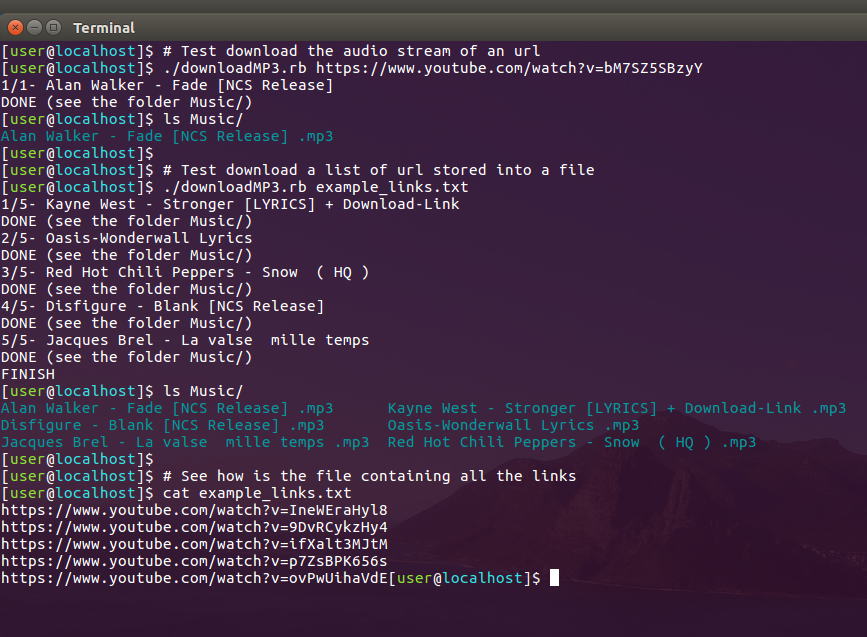

##

A ruby script to download the audio stream of any kind of youtube video

## Needed Gems
- nokogiri
- open-uri
- youtube-dl.rb  https://github.com/layer8x/youtube-dl.rb

## Commands
Download from a youtube link 
`./downloadMP3.rb https://www.youtube.com/watch?v=bM7SZ5SBzyY` 
 
Download multiple songs from a file containing several url 
`./downloadMP3.rb example_links.txt` 
 
All the .mp3 files will be sotred into the folder named "Music" (will be created if it doesn't exist)

## Example

## Licence
This project is licensed under the GNU GPL v2. See GPL.txt for details.